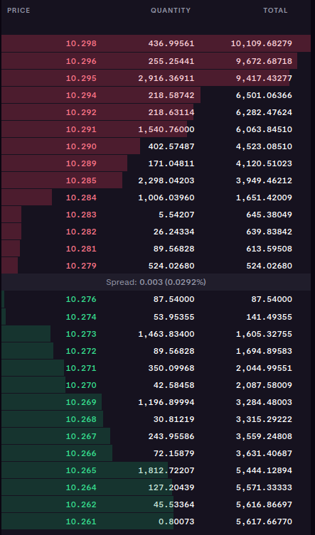

# Crypto Trader

Crypto Trader is bot executing automated spread trades on Kraken crypto exchange.

## What is spread trading
Any exchange (crypto or stock) joins buyers who are placing the **buy orders for the Bid price** and sellers who are placing **sell orders for the Ask price**. Bid and Ask price oscilate around **mid price, which can be considered as the market price**. All bids and asks are collected in the **order book** of the exchanage and wait for execution. When the Bid or Ask price is far away frome the market price, the order may be never executed.


**Spread** is the difference between the Bid and Ask price closest to the mid price. These prices has the highest probability of being executed. Spread size depends on market conditions, asset volatility and liquidity and is mostly between 0.01 - 0.5%.

### Example:


Red: Ask price (Sell orders) 10.279
Green: Bid price (Buy orders) 10.276

Ask price is always higher than the market price. Sellers (asset owners) want to sell for a higher price.
Bid price is always lower than the market price. Buyers want always to buy cheaper.

The logic behind the spread trading is mimicking the buyers and sellers - buy slightly below the mid price and sell slightly above the mid price and profit based on small price movements.
There are also some risks associated (e.g. sudden market volatility, trading fees etc.)


## Run the bot
Generate API key in the Settings of your profilewith the following permissions: `Query`, `Query open orders & trades`, `Query closed orders & trades`, `Create & modify orders`. You will receive `KRAKEN_API_KEY` and `KRAKEN_PRIVATE_KEY`. Export them:
```
export KRAKEN_API_KEY=abcd
export KRAKEN_PRIVATE_KEY=abcd
```

Compile the binary (alternatively run by `go run .`):
```
cd /src/
go mod tidy
go build .
```

Run as:
```
❯ ./crypto-trader -h
Usage of ./crypto-trader:
  -coin string
        Base coin to trade (e.g. BTC, SOL)
  -order
        Place the orders (default: false). Otherwise dry-run without order placement.
  -untradeable
        Place orders at inflated untradeable prices. Dry-run with order placement.
  -volume float
        Volume of cryptocoin to trade (default: 100.0)


./crypto-trader -coin TRUMP -order -volume 100.0
```

## Caveats
The bot is using various Kraken API endpoints, e.g. for checking available balance and for placing the order. These endpoints returns the same cryptocoin with slightly different code. For that reason we need to map them to each other manunally and `krakenAssetCode` fuction is used. If you need to trade with custom trading pairs and cryptocoins, you may need to extend `krakenAssetCode` function.
```
// Balance and Ticker API ndpoints expect different asset codes. Conversion needed.
func krakenAssetCode(standardCode string) (string, error) {
	hardcodedMap := map[string]string{
		"BTC":    "XBT.F",
		"ETH":    "ETH",
		"SOL":    "SOL.F",
		"SUNDOG": "SUNDOG",
		"TRUMP":  "TRUMP",
	}
..snipped...
```
