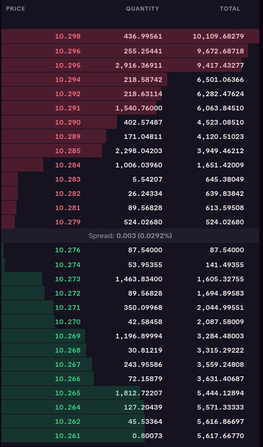

# Crypto Trader

A trading bot for cryptocurrency markets that executes trades based on price spreads.

## Features

- Automated trading based on price spreads
- Support for multiple cryptocurrencies
- Price monitoring and limit order placement
- Narrowing spread to increase probability of trades to be executed
- Detailed logging and reporting

## What is spread trading
Any exchange (crypto or stock) joins buyers who are placing the **buy orders for the Bid price** and sellers who are placing **sell orders for the Ask price**. Bid and Ask price oscillate around **mid price, which can be considered as the market price**. All bids and asks are collected in the **order book** of the exchange and wait for execution. When the Bid or Ask price is far away from the market price, the order may never be executed.

**Spread** is the difference between the Bid and Ask price closest to the mid price. These prices have the highest probability of being executed. Spread size depends on market conditions, asset volatility and liquidity:
- **Tight spreads (0.01 - 0.1%)**: Major pairs like BTC/USD, ETH/USD, ETH/BTC
- **Wide spreads (0.5% - 5%)**: Altcoins with lower liquidity

### Example:


Red: Ask price (Sell orders) 10.279
Green: Bid price (Buy orders) 10.276

Ask price is always higher than the market price. Sellers (asset owners) want to sell for a higher price.
Bid price is always lower than the market price. Buyers always want to buy cheaper.

The logic behind spread trading is mimicking the buyers and sellers - buy slightly below the mid price and sell slightly above the mid price and profit based on small price movements.

**The bot now supports any trading pair**: BTC/USD, ETH/BTC, SUNDOG/USD, etc.

There are also some risks associated (e.g. sudden market volatility, trading fees, trending markets)

## Setup

1. Generate API key in the Settings of your Kraken profile with the following permissions:
   - `Query`
   - `Query open orders & trades`
   - `Query closed orders & trades`
   - `Create & modify orders`

2. Export your API credentials:
   ```bash
   export KRAKEN_API_KEY=your_api_key
   export KRAKEN_PRIVATE_KEY=your_private_key
   export SLACK_WEBHOOK=your_webhook_url  # Optional
   ```

3. Build the binaries:
   ```bash
   go mod tidy
   go build -o bin/trader ./cmd/trader
   go build -o bin/loop ./cmd/loop
   ```

## Usage

### Trader Bot
Execute single trade:
```bash
go run cmd/trader/main.go -pair <BASE/QUOTE> -volume <AMOUNT> [-order] [-untradeable]
```

#### Examples of a single trade
```bash
# Simulate a trade without actually placing orders (to see balance and asset codes)
go run cmd/trader/main.go -pair ETH/BTC -volume 1

# Place a real order. Trade ETH against BTC (1 ETH)
go run cmd/trader/main.go -pair ETH/BTC -volume 1 -order

# Place untradeable orders in extreme prices (for testing)
go run cmd/trader/main.go -pair ETH/BTC -volume 0.01 -order -untradeable
```

#### Trading conditions
Can be set in `cmd/trader/main.go`:
- **minSpreadPercent** = 0  // Minimum spread percentage (0 = accept any spread)
- **minVolume24h** = 100000.0 // Minimum 24h volume in quote currency
- **maxADX** = 20.0 // Maximum ADX value (ADX < 20 = weak trend, ideal for spread trading)
- **adxPeriod** = 14 // ADX calculation period (standard is 14)
- **spreadAdjustFactor** = 0.5  // Spread adjustment: 0=no spread, 0.5=half, 1=full, 2=double, etc.

### Loop Bot
Executes trades in a loop with 5-minute delays between iterations:
```bash
# Execute 50 iterations of ETH/BTC trades
go run cmd/loop/main.go -pair ETH/BTC -volume 0.01 -iterations 50

# Execute 20 iterations of SUNDOG/USD trades
go run cmd/loop/main.go -pair SUNDOG/USD -volume 300 -iterations 20
```

## Utils
```
go run cmd/utils/check-balance.go
go run cmd/utils/volume-spread-scanner.go
```

### Trading Strategy

#### Spread Adjustment
The bot uses `spreadAdjustFactor` to control spread size. The factor multiplies the market spread:
- **0** = no spread (orders at center price, no profit)
- **0.5** = half the market spread (higher execution probability, lower profit)
- **1.0** = full market spread (use market bid/ask prices)
- **2.0** = double the market spread (lower execution probability, higher profit potential)

Example: Market spread $0.10, factor 0.7 → adjusted spread $0.07. Factor < 1 increases execution probability by placing orders closer to center price.

#### ADX Indicator Filter
The bot checks ADX (Average Directional Index) before placing trades:
- **ADX < 20** = weak/no trend → ✅ **Good for spread trading** (ranging market)
- **ADX 20-40** = strong trend → ❌ Avoid (market trending, spread trading risky)
- **ADX > 40** = very strong trend → ❌ Avoid (high directional movement)

The bot only places trades when **ADX ≤ 20**, ensuring market conditions favor spread strategies. If conditions aren't met, the bot waits 30 seconds and rechecks.


## Asset Codes
Trading API endpoints use human
Some Kraken API endpoints needs conversion from human-readable codes to asset codes. For example:
- BTC → XBT.F
- ETH → ETH
- SOL → SOL.F
- SUNDOG → SUNDOG

If unsure, dry-run the crypto-trader by omitting `-order` flag and check the balance JSON output.
Add the pair to the `KrakenAssetCode` function in `internal/kraken/balance.go` if needed.

Example:
```go
func KrakenAssetCode(standardCode string) (string, error) {
    hardcodedMap := map[string]string{
        "BTC":    "XXBT",
        "ETH":    "XETH",
        "SOL":    "SOL.F",
        "SUNDOG": "SUNDOG",
        "TRUMP":  "TRUMP",
        "GUN":    "GUN",
        "OCEAN":  "OCEAN",
        "GHIBLI": "GHIBLI",
    }
    // Add your new pair here
    // ...
}
```
